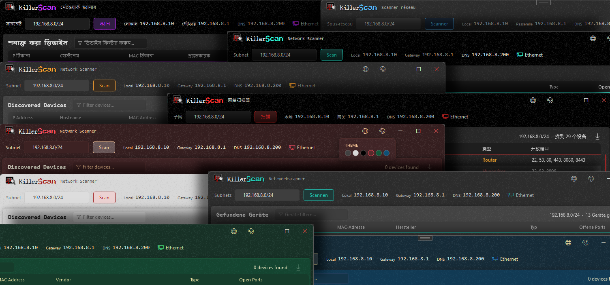

# KillerScan

One-click, fast network scanner built for field techs.

- ARP + ping discovery, port probing
- Active fingerprinting (HTTP title, SSH banner, TLS cert, NetBIOS, SNMP)
- mDNS/SSDP service discovery
- MAC vendor lookup across the full IEEE OUI registries
- Weighted-score device classifier

Single portable EXE, no runtime install required.
Free, open-source, GPLv3.

Homepage: <https://killerscan.net> · Part of [killertools.net](https://killertools.net).



## Features

- Self-installer: launch the EXE to install to `%LOCALAPPDATA%\Programs\KillerScan\` with Start Menu and optional desktop shortcut, or just run it portable with no install
- ARP cache + parallel ping sweep for fast discovery; a second ARP pass after the sweep catches phones and devices that block ICMP
- TCP port scan across 30+ common service ports, plus active fingerprinting: HTTP title/Server header, SSH banner, TLS cert subject, NetBIOS name (UDP 137), SNMPv1 sysDescr (UDP 161), ICMP TTL
- mDNS (Bonjour) and SSDP (UPnP) discovery to spot Chromecasts, printers, Sonos, AirPlay, Roku, Plex and Synology devices
- MAC vendor identification across the full IEEE registries (MA-L, MA-M, MA-S) with longest-prefix matching, brand overrides for "Private" blocks, and a clear label for randomized privacy MACs; the vendor database is refreshable from within the app (About screen)
- Weighted-score classifier identifies hypervisors, Windows boxes, Linux servers, printers, NAS, network gear, cameras, IoT, mobile, Home Assistant and more; gateway/DNS aware (Router, DNS Server, or Router/DNS - Pi-hole safe)
- Right-click to copy IP/MAC/hostname, launch RDP/SSH/browser, or override a device type
- CSV and HTML export
- Six themes with per-theme accent colours, plus a UI scaffolded for 8 languages

## Requirements

- Windows 10 or 11 (x64)
- No runtime install. Everything needed is inside the EXE (targets .NET Framework 4.8, which ships with every supported Windows release).
- Run as admin for best ARP results on some networks

## Download

- Prebuilt binary: <https://github.com/SteveTheKiller/KillerScan/releases/latest/download/KillerScan.exe>
- Source (GPL3 corresponding source for this release): <https://github.com/SteveTheKiller/KillerScan/releases/download/v1.5.1/KillerScan-1.5.1-src.zip>

Or install from a package manager:

```powershell
winget install killerscan
# or
choco install killerscan
```

## Build from source

```powershell
git clone https://github.com/SteveTheKiller/KillerScan.git
cd KillerScan
dotnet publish -c Release
```

Output lands in `bin/Release/net48/publish/`. The publish step produces a single Costura-bundled `KillerScan.exe` plus a versioned `KillerScan-<version>-src.zip` for GPL3 source distribution.

Requires the .NET 8 SDK or later to build (even though the output targets .NET Framework 4.8).

## Translations

UI strings live in `Strings/` (one XAML `ResourceDictionary` per locale). To add or improve a language, see [TRANSLATING.md](TRANSLATING.md). Missing keys fall back to English.

## Changelog

See [CHANGELOG.md](CHANGELOG.md).

## How classification works

The classifier accumulates points from every signal (open ports, OUI vendor, hostname keywords, HTTP title, SSH banner, TLS subject, SNMP description, NetBIOS name, TTL, mDNS service types, SSDP SERVER string) and picks the highest-scoring type above a threshold. This replaces brittle first-match port rules and avoids false positives like "my coworker's laptop is a hypervisor because port 2179 is open."

See `Services/NetworkScanner.cs` -> `ClassifyDevice` for the scoring table. For a full technical breakdown of how KillerScan works end to end - the scan pipeline, vendor resolution, and the classifier - see <https://killerscan.net/technical.html>.

## License

GPLv3. See [LICENSE](LICENSE). If you fork, modify, or redistribute KillerScan, your version must also be released under GPLv3 with source available. No exceptions for commercial rebrands.
