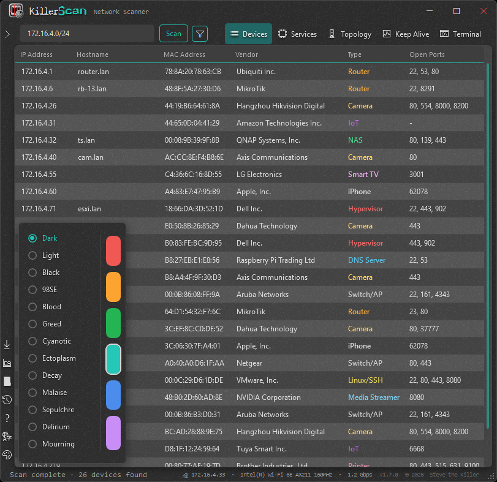
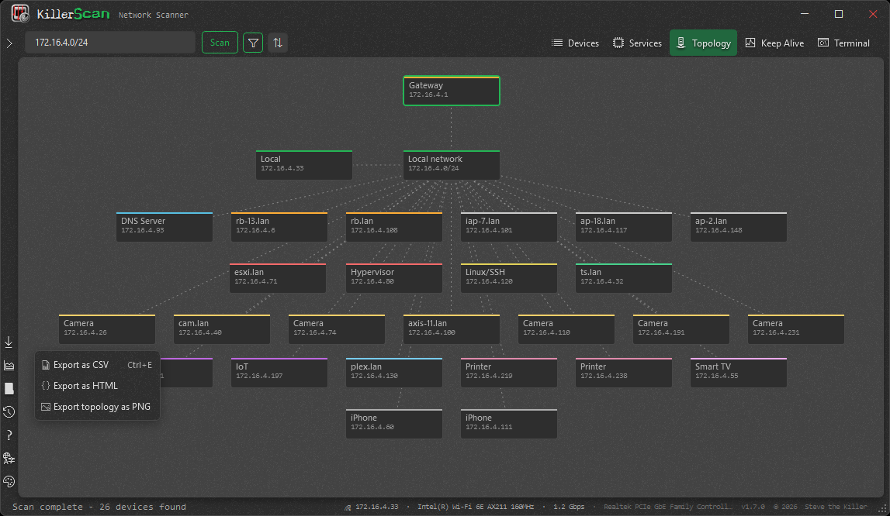
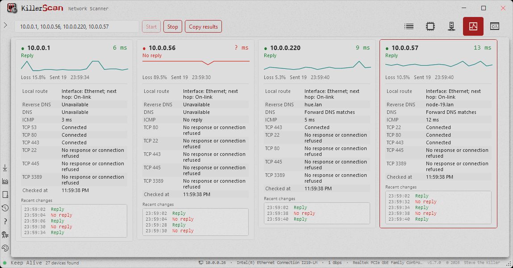
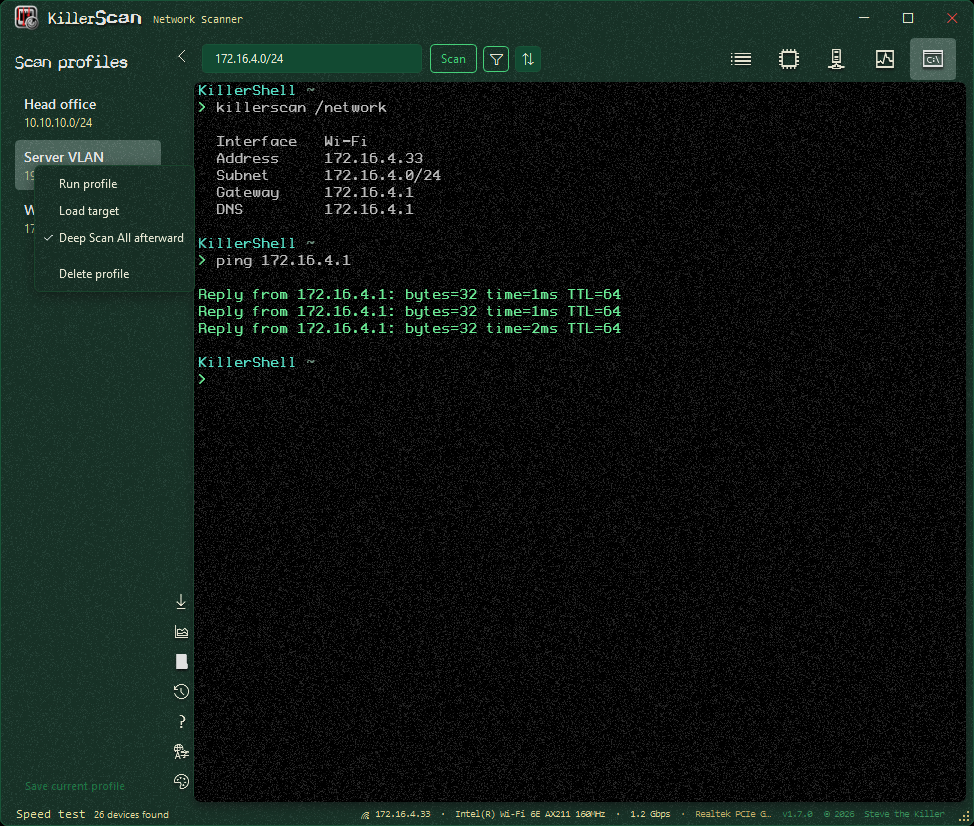

<p align="center">
  <a href="https://killerscan.net"></a>
</p>

One-click, fast network scanner built for field techs.

- ARP + ping discovery, port probing
- Active fingerprinting (HTTP title, SSH banner, TLS cert, NetBIOS, SNMP)
- mDNS/SSDP service discovery
- MAC vendor lookup across the full IEEE OUI registries
- Weighted-score device classifier

Single portable EXE, no runtime install required.
Free, open-source, GPLv3.

Part of [killertools.net](https://killertools.net).

## Features

- Permanent Scan, Topology, Keep Alive and Terminal views sit on the right of the scan toolbar. Each keeps its own state, and a right-click menu sets icon size and caption placement.
- Embedded terminals run PowerShell, ping, and SSH using the system clients, preferring PowerShell 7 where it is installed. They use KillerShell's font, palette and prompt, and the prompt unpacks to a file you can edit and keeps your version across upgrades. The KillerScripts module travels inside the EXE, so it is there on a machine you cannot install anything on. Closing a terminal ends its process.
- Keep Alive (F2) watches any number of selected devices at once, each as a status card with a latency sparkline, packet loss, its own checks on banded rows, and its own event log. Right-click a card to copy the address, run diagnostics, reset its counters, or drop it from the run. Checks start for the whole set as soon as a run begins.
- Topology (F9) infers how the network fits together and draws devices as movable, multi-selectable boxes in four arrangement modes, cycled with F7 or picked directly with Ctrl+1 through Ctrl+4. Connectors stay attached to boxes you move, and the arranged view exports as a full-resolution PNG.
- Deep Scan runs an exhaustive, cancellable rescan of every discovered host to improve hostnames, services and classifications.
- Scan history (F6) compares each scan against the last for added, missing and changed devices, and supports trusted-device baselines with alerts for unknown devices. Scan profiles (F10) remember targets you can load or run, optionally following with Deep Scan. Both share a sliding sidebar that opens from the icon rail and resizes by dragging.
- A service-centric view (F8) organizes results by discovered service, port and device.
- Manual device names and classifications both persist across restarts and rescans.
- Self-installer: launch the EXE to install to `%LOCALAPPDATA%\Programs\KillerScan\` with Start Menu and optional desktop shortcut, or tick "Install for all users" to install to Program Files for every account on the PC (the only path that asks for admin), or just run it portable with no install. An installed copy is added to PATH, so a new terminal can run it as `KillerScan` from any directory
- Scan several networks in one pass: the subnet box takes a comma-separated list of CIDR blocks (`192.168.9.0/24, 192.168.10.0/24`), single hosts (`192.168.1.7`), and ranges written in full (`192.168.1.10-192.168.1.50`) or shorthand (`192.168.1.10-50`); spacing is forgiving and overlapping targets are counted once
- ARP cache + parallel ping sweep for fast discovery; a second ARP pass after the sweep catches phones and devices that block ICMP
- TCP port scan across 30+ common service ports, plus active fingerprinting: HTTP title/Server header, SSH banner, TLS cert subject, NetBIOS name (UDP 137), SNMPv1 sysDescr (UDP 161), ICMP TTL
- mDNS (Bonjour) and SSDP (UPnP) discovery to spot Chromecasts, printers, Sonos, AirPlay, Roku, Plex and Synology devices
- MAC vendor identification across the full IEEE registries (MA-L, MA-M, MA-S) with longest-prefix matching, brand overrides for "Private" blocks, and a clear label for randomized privacy MACs; the vendor database is refreshable from within the app (About screen)
- Weighted-score classifier identifies hypervisors, Windows boxes, Linux servers, printers, NAS, network gear, cameras, IoT, mobile, Home Assistant and more; gateway/DNS aware (Router, DNS Server, or Router/DNS - Pi-hole safe)
- Right-click to copy IP/MAC/hostname, launch RDP/SSH/browser, or override a device type. SSH does not assume your Windows account name: it asks which user to sign in as the first time you reach a device, remembers the answer against that device's MAC, and offers "SSH as..." for connecting as somebody else
- Export follows the active view: devices as CSV or HTML anywhere, the arranged topology as a PNG in Topology, and the service list as a CSV in Services
- Device diagnostics (F3 or the device menu) checks reverse and forward DNS, ICMP replies, the local route, and common or previously discovered TCP ports. Results can be copied for ticket notes. A missing ping reply does not mean the device is offline.
- Headless command line for scripts and RMM work: scan one or several targets, deep-probe one host, inspect the active network, or look up a MAC vendor. Filter by text, type, vendor, or ports; sort and limit results; set progress and timeout behavior; and emit table, CSV, JSON, or themed HTML to the console or a file. No window opens, it runs while the app is open, and it returns distinct exit codes for success, failure, bad usage, and empty results
- Keyboard shortcuts, on F1, which switches between a grouped shortcut list in two colored columns and a persistent keyboard map that paints each key in its category color: F5 scan/stop, Esc cancel, Ctrl+R deep rescan the selection, Ctrl+F subnet box, Ctrl+A select all, Ctrl+E export, F2 Keep Alive, F3 diagnostics, F6 history, F7 topology arrangement, F8 services, F9 topology, F10 profiles, F12 About, and single-key device actions (ping, RDP, SSH, browser, copy IP/MAC/hostname)
- App-wide size control from 70% to 250%, on Ctrl+Shift+plus/minus/0 or the mouse wheel over the title-bar wordmark; text reflows at the new size and the setting is remembered
- Thirteen themes, of which Dark, Light, Black and 98SE each take one of six accent colors for 33 looks in all, including a full Windows 98 treatment; theme, accent, language, and app size are remembered; localized in 15 languages (English, Spanish, Traditional and Simplified Chinese, German, French, Turkish, Bengali, Japanese, Czech, Kazakh, Polish, Hungarian, Italian, Russian)

## Screenshots

<table>
<tr>
<td width="50%"><br><sub>A completed scan with IP addresses, hostnames, MAC vendors, device classifications and open ports in one sortable view, with the theme picker open.</sub></td>
<td width="50%"><br><sub>Topology draws the same devices as a picture you can rearrange, and exports the arranged view as a full-resolution PNG.</sub></td>
</tr>
<tr>
<td width="50%"><br><sub>Keep Alive watches devices continuously: a latency graph, packet loss, per-device checks and an event log of exactly when each one dropped and came back.</sub></td>
<td width="50%"><br><sub>A real terminal inside the app, running PowerShell with KillerShell's prompt, beside the saved scan profiles that can load or run a remembered target.</sub></td>
</tr>
</table>

## Requirements

- Windows 10 or 11 (x64)
- No runtime install. Everything needed is inside the EXE (targets .NET Framework 4.8, which ships with every supported Windows release).
- Run as admin for best ARP results on some networks

## Download

- Prebuilt binary: <https://github.com/SteveTheKiller/KillerScan/releases/latest/download/KillerScan.exe>
- Source (GPL3 corresponding source for this release): <https://github.com/SteveTheKiller/KillerScan/releases/download/v1.6.1/KillerScan-1.6.1-src.zip>

Or install from a package manager:

```powershell
winget install killerscan
# or
choco install killerscan
```

## Build from source

```powershell
git clone https://github.com/SteveTheKiller/KillerScan.git
cd KillerScan
dotnet publish -c Release
```

Output lands in `bin/Release/net48/publish/`. The publish step produces a single Costura-bundled `KillerScan.exe` plus a versioned `KillerScan-<version>-src.zip` for GPL3 source distribution.

Requires the .NET 8 SDK or later to build (even though the output targets .NET Framework 4.8).

## Translations

UI strings live in `Strings/` (one XAML `ResourceDictionary` per locale). To add or improve a language, see [TRANSLATING.md](TRANSLATING.md). Missing keys fall back to English.

## Changelog

See [CHANGELOG.md](CHANGELOG.md).

## How classification works

The classifier accumulates points from every signal (open ports, OUI vendor, hostname keywords, HTTP title, SSH banner, TLS subject, SNMP description, NetBIOS name, TTL, mDNS service types, SSDP SERVER string) and picks the highest-scoring type above a threshold. This replaces brittle first-match port rules and avoids false positives like "my coworker's laptop is a hypervisor because port 2179 is open."

See `Services/NetworkScanner.cs` -> `ClassifyDevice` for the scoring table. For a full technical breakdown of how KillerScan works end to end - the scan pipeline, vendor resolution, and the classifier - see <https://killerscan.net/technical.html>.

## License

GPLv3. See [LICENSE](LICENSE). If you fork, modify, or redistribute KillerScan, your version must also be released under GPLv3 with source available. No exceptions for commercial rebrands.
